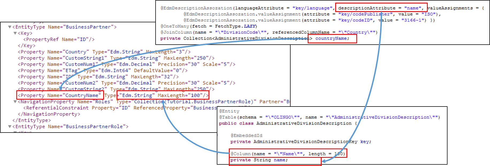

#Tutorial 1.3: Text Associations
Next we want to add the country our business partner is located at. Please note that this country may or may not be the same that we will see in the address later. The country shall be stored as a ISO 3166-1 character 3 coded value, so DEU for Germany or GBR for United Kingdom. In addition the description, so _Germany_ respectively _United Kingdom_,  of the code value should be provided at the Business Partner. The description itself will be stored within the database table _AdministrativeDivisionDescription_.
The table shall not only store the description for countries, but shall be able to store the description of coded representation of a division of countries, which maybe provided by different authorities. Therefore it will get four key fields:  
1. CodePublisher: Representing the publisher of a code list e.g. [ISO](https://en.wikipedia.org/wiki/International_Organization_for_Standardization) or [Eurostat](https://en.wikipedia.org/wiki/Eurostat)  
2. CodeID: The ID of the code list. Here [3166-1](https://en.wikipedia.org/wiki/ISO_3166-1) or [NUTS-3](https://de.wikipedia.org/wiki/NUTS)  
3. DivisionCode: The coded respresentation. So e.g. BEL or CHE  
4. LanguageISO: Language coded in [ISO 639-1](https://en.wikipedia.org/wiki/List_of_ISO_639-1_codes)   

So we need for JPA a key class:  
```Java    
package tutorial.model;  
import java.io.Serializable;

import javax.persistence.Column;
import javax.persistence.Embeddable;

@Embeddable
public class AdministrativeDivisionDescriptionKey implements Serializable {

    private static final long serialVersionUID = 1L;

    @Column(name = "\"CodePublisher\"", length = 10, nullable = false)
    private String codePublisher;

    @Column(name = "\"CodeID\"", length = 10, nullable = false)
    private String codeID;

    @Column(name = "\"DivisionCode\"", length = 10, nullable = false)
    private String divisionCode;

    @Column(name = "\"LanguageISO\"")
    private String language;

    @Override
    public int hashCode() {
        final int prime = 31;
        int result = 1;
        result = prime * result + ((codeID == null) ? 0 : codeID.hashCode());
        result = prime * result + ((codePublisher == null) ? 0 : codePublisher.hashCode());
        result = prime * result + ((divisionCode == null) ? 0 : divisionCode.hashCode());
        result = prime * result + ((language == null) ? 0 : language.hashCode());
        return result;
    }

    @Override
    public boolean equals(Object obj) {
        if (this == obj)
            return true;
        if (obj == null)
            return false;
        if (getClass() != obj.getClass())
            return false;
        AdministrativeDivisionDescriptionKey other = (AdministrativeDivisionDescriptionKey) obj;
        if (codeID == null) {
            if (other.codeID != null)
                    return false;
            } else if (!codeID.equals(other.codeID))
                    return false;
        if (codePublisher == null) {
            if (other.codePublisher != null)
                    return false;
            } else if (!codePublisher.equals(other.codePublisher))
                    return false;
        if (divisionCode == null) {
            if (other.divisionCode != null)
                    return false;
        } else if (!divisionCode.equals(other.divisionCode))
            return false;
        if (language == null) {
            if (other.language != null)
                return false;
        } else if (!language.equals(other.language))
            return false;
        return true;
    }
}
```
Please note, that we became a little more lazy and declared the class as _@Embeddable_. This will allow us to simplify _AdministrativeDivisionDescription_ as we do not need to declare the key attributes again. Instead of that we annotate the key attribute with _@EmbeddedId_:
```Java
package tutorial.model;

import javax.persistence.Column;
import javax.persistence.EmbeddedId;
import javax.persistence.Entity;
import javax.persistence.Table;

@Entity
@Table(schema = "\"OLINGO\"", name = "\"AdministrativeDivisionDescription\"")
public class AdministrativeDivisionDescription {

    @EmbeddedId
    private AdministrativeDivisionDescriptionKey key;

    @Column(name = "\"Name\"", length = 100)
    private String name;

    public String getName() {
        return name;
    }

    public void setName(String name) {
        this.name = name;
    }
}
```
Last step before we can add country and country description to the Business Partner is to publish the classes at the _persistance.xml_: 
```XML
<?xml version="1.0" encoding="UTF-8"?>
...
	<persistence-unit name="Tutorial">
		<class>tutorial.model.BusinessPartner</class>
		<class>tutorial.model.BusinessPartnerRole</class>
		<class>tutorial.model.AdministrativeDivisionDescription</class>
		<class>tutorial.model.AdministrativeDivisionDescriptionKey</class>
		<properties>
			<property name="eclipselink.logging.level.sql" value="FINEST" />
			...
		</properties>
	</persistence-unit>	
</persistence>	
```

Now we can add the country and its description attribute to BusinessPartner. The description attribute is represented by an association to AdministrativeDivisionDescription. The association has an additional annotation, _@EdmDescriptionAssoziation_. This is used to provide some more metadata, which is needed later to generate a LEFT OUTER join. These are:  
1. The path to the attribute containing the language separated by "/". Here the attribute within AdministrativeDivisionDescription is _key_ and the attribute within _key_ is _language_.  
2. The path to the attribute with the description.  
3. An optional list of attributes of the join that shall have a fixed value.  
  
```Java
public class BusinessPartner implements Serializable {  
    ...  
     @Column(name = "\"Country\"", length = 3)  
    private String country;  

    @EdmDescriptionAssoziation(languageAttribute = "key/language", descriptionAttribute = "name", valueAssignments = {
                    @EdmDescriptionAssoziation.valueAssignment(attribute = "key/codePublisher", value = "ISO"),
                    @EdmDescriptionAssoziation.valueAssignment(attribute = "key/codeID", value = "3166-1") })
    @OneToMany(fetch = FetchType.LAZY)
    @JoinColumn(name = "\"DivisionCode\"", referencedColumnName = "\"Country\"", insertable = false, updatable = false)
    private Collection<AdministrativeDivisionDescription> countryName;
    ...
```
You may wonder why we do not use a OneToOne relation, but we are not able to fully qualify the key of the target table, as we at least can't provide the language. A usage of OneToOne would therefore result in an exception like  
_The @JoinColumns on the annotated element [field countryName] from the entity class [class tutorial.model.BusinessPartner] is incomplete. When the source entity class uses a composite primary key, a @JoinColumn must be specified for each join column using the @JoinColumns. Both the name and the referencedColumnName elements must be specified in each such @JoinColumn._ 

Having done that, we can have a look at the generated metadata: _http://localhost:8080/Tutorial/Tutorial.svc/$metadata_.

   

Next step: [Tutorial 1.4: Subtypes](1.4 Subtypes.md)