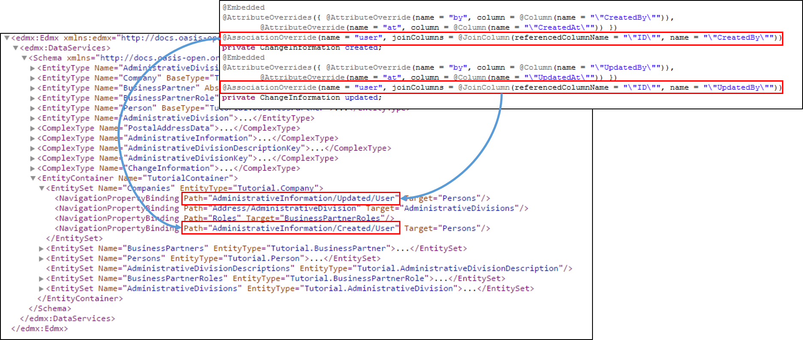

#Tutorial 1.6: Navigation Properties And Complex Types
You may have noticed, that the address has a region. We want to give the opportunity to get more details about the region. 
So we need to create navigation property to an entity that has this details. The entity, AdministrativeDivision, can contain e.g. the population and the area or a link to a super-ordinate 
region and is the last one we create. AdministrativeDivision, as  AdministrativeDivisionDescription, has a key build out of three attributes, so as usual we need a separate class for the key:
```Java
package tutorial.model;

import java.io.Serializable;

import javax.persistence.Column;
import javax.persistence.Embeddable;

@Embeddable
public class AdministrativeDivisionKey implements Serializable {

	private static final long serialVersionUID = 1L;

	@Column(name = "\"CodePublisher\"", length = 10)
	private String codePublisher;

	@Column(name = "\"CodeID\"", length = 10)
	private String codeID;

	@Column(name = "\"DivisionCode\"", length = 10)
	private String divisionCode;

	@Override
	public int hashCode() {
		final int prime = 31;
		int result = 1;
		result = prime * result + ((codeID == null) ? 0 : codeID.hashCode());
		result = prime * result + ((codePublisher == null) ? 0 : codePublisher.hashCode());
		result = prime * result + ((divisionCode == null) ? 0 : divisionCode.hashCode());
		return result;
	}

	@Override
	public boolean equals(Object obj) {
		if (this == obj)
			return true;
		if (obj == null)
			return false;
		if (getClass() != obj.getClass())
			return false;
		AdministrativeDivisionKey other = (AdministrativeDivisionKey) obj;
		if (codeID == null) {
			if (other.codeID != null)
				return false;
		} else if (!codeID.equals(other.codeID))
			return false;
		if (codePublisher == null) {
			if (other.codePublisher != null)
				return false;
		} else if (!codePublisher.equals(other.codePublisher))
			return false;
		if (divisionCode == null) {
			if (other.divisionCode != null)
				return false;
		} else if (!divisionCode.equals(other.divisionCode))
			return false;
		return true;
	}
}
```
With that we can create AdministrativeDivision:
```Java
package tutorial.model;

import java.util.List;

import javax.persistence.CascadeType;
import javax.persistence.Column;
import javax.persistence.Entity;
import javax.persistence.FetchType;
import javax.persistence.Id;
import javax.persistence.IdClass;
import javax.persistence.JoinColumn;
import javax.persistence.JoinColumns;
import javax.persistence.ManyToOne;
import javax.persistence.OneToMany;
import javax.persistence.Table;

@IdClass(AdministrativeDivisionKey.class)
@Entity(name = "AdministrativeDivision")
@Table(schema = "\"OLINGO\"", name = "\"AdministrativeDivision\"")
public class AdministrativeDivision {

	@Id
	@Column(name = "\"CodePublisher\"", length = 10)
	private String codePublisher;
	@Id
	@Column(name = "\"CodeID\"", length = 10)
	private String codeID;
	@Id
	@Column(name = "\"DivisionCode\"", length = 10)
	private String divisionCode;

	@Column(name = "\"CountryISOCode\"", length = 4)
	private String countryCode;
	@Column(name = "\"ParentCodeID\"", length = 10)
	private String parentCodeID;
	@Column(name = "\"ParentDivisionCode\"", length = 10)
	private String parentDivisionCode;
	@Column(name = "\"AlternativeCode\"", length = 10)
	private String alternativeCode;
	@Column(name = "\"Area\"")
	private Integer area;
	@Column(name = "\"Population\"")
	private long population;

	@ManyToOne(fetch = FetchType.LAZY, optional = true)
	@JoinColumns({
			@JoinColumn(referencedColumnName = "\"CodePublisher\"", name = "\"CodePublisher\"", nullable = false, insertable = false, updatable = false),
			@JoinColumn(referencedColumnName = "\"CodeID\"", name = "\"ParentCodeID\"", nullable = false, insertable = false, updatable = false),
			@JoinColumn(referencedColumnName = "\"DivisionCode\"", name = "\"ParentDivisionCode\"", nullable = false, insertable = false, updatable = false) })
	private AdministrativeDivision parent;

	@OneToMany(mappedBy = "parent", fetch = FetchType.LAZY)
	@JoinColumns({
			@JoinColumn(referencedColumnName = "\"CodePublisher\"", name = "\"CodePublisher\"", nullable = false, insertable = false, updatable = false),
			@JoinColumn(referencedColumnName = "\"CodeID\"", name = "\"ParentCodeID\"", nullable = false, insertable = false, updatable = false),
			@JoinColumn(referencedColumnName = "\"DivisionCode\"", name = "\"ParentDivisionCode\"", nullable = false, insertable = false, updatable = false) })
	private List<AdministrativeDivision> children;

}
```
Please not, that with the current design it is not possible to create a link between regions of different code publisher.  
Having done that, we can create a association from the address to a administrative division:  
```Java
@Embeddable
public class PostalAddressData {
	...
	@Column(name = "\"Address.Region\"")
	private String region;

	@ManyToOne(fetch = FetchType.LAZY)
	@JoinColumns({
			@JoinColumn(name = "\"Address.RegionCodePublisher\"", referencedColumnName = "\"CodePublisher\"", nullable = false, insertable = false, updatable = false),
			@JoinColumn(name = "\"Address.RegionCodeID\"", referencedColumnName = "\"CodeID\"", nullable = false, insertable = false, updatable = false),
			@JoinColumn(name = "\"Address.Region\"", referencedColumnName = "\"DivisionCode\"", nullable = false, insertable = false, updatable = false) })
	private AdministrativeDivision administrativeDivision;	
```
If we would now have a look at the metadata, we will notice the navigation property at the complex type PostalAddressData. 
```XML
<ComplexType Name="PostalAddressData">
	<Property Name="POBox" Type="Edm.String" MaxLength="255"/>
	<Property Name="Country" Type="Edm.String" MaxLength="255"/>
	<Property Name="StreetName" Type="Edm.String" MaxLength="255"/>
	<Property Name="CityName" Type="Edm.String" MaxLength="255"/>
	<Property Name="PostalCode" Type="Edm.String" MaxLength="255"/>
	<Property Name="HouseNumber" Type="Edm.String" MaxLength="255"/>
	<Property Name="RegionCodePublisher" Type="Edm.String" DefaultValue="ISO" MaxLength="10"/>
	<Property Name="Region" Type="Edm.String" MaxLength="255"/>
	<Property Name="RegionCodeID" Type="Edm.String" DefaultValue="3166-2" MaxLength="10"/>
	<NavigationProperty Name="AdministrativeDivision" Type="Tutorial.AdministrativeDivision">
		<ReferentialConstraint Property="RegionCodePublisher" ReferencedProperty="CodePublisher"/>
		<ReferentialConstraint Property="RegionCodeID" ReferencedProperty="CodeID"/>
		<ReferentialConstraint Property="Region" ReferencedProperty="DivisionCode"/>
	</NavigationProperty>
</ComplexType>
```
In case we have nested embedded types like we have with ChangeInformation we have the same problem we had with the attribute names and have to solve in the same way. 
To show that we want to assume that the user is a Person:
```Java
import java.sql.Timestamp;

import javax.persistence.Column;
import javax.persistence.Embeddable;
import javax.persistence.JoinColumn;
import javax.persistence.ManyToOne;

@Embeddable
public class ChangeInformation {

	@Column
	private String by;
	@Column
	private Timestamp at;

	@ManyToOne
	@JoinColumn(name = "\"by\"", referencedColumnName = "\"ID\"", insertable = false, updatable = false)
	Person user;
}
``` 
Next we have to rename it, so that AdministrativeInformation looks as follows:
```Java
package tutorial.model;

import javax.persistence.AssociationOverride;
import javax.persistence.AttributeOverride;
import javax.persistence.AttributeOverrides;
import javax.persistence.Column;
import javax.persistence.Embeddable;
import javax.persistence.Embedded;
import javax.persistence.JoinColumn;

@Embeddable
public class AdministrativeInformation {

	@Embedded
	@AttributeOverrides({ @AttributeOverride(name = "by", column = @Column(name = "\"CreatedBy\"")),
			@AttributeOverride(name = "at", column = @Column(name = "\"CreatedAt\"")) })
	@AssociationOverride(name = "user", joinColumns = @JoinColumn(referencedColumnName = "\"ID\"", name = "\"CreatedBy\""))
	private ChangeInformation created;
	@Embedded
	@AttributeOverrides({ @AttributeOverride(name = "by", column = @Column(name = "\"UpdatedBy\"")),
			@AttributeOverride(name = "at", column = @Column(name = "\"UpdatedAt\"")) })
	@AssociationOverride(name = "user", joinColumns = @JoinColumn(referencedColumnName = "\"ID\"", name = "\"UpdatedBy\""))
	private ChangeInformation updated;
}
```
As it is not so easy to find that the navigation properties are really defined at the Person and the Company we should have a look at the mapping picture:

   

Next step: [Tutorial 1.7: Suppressing Elements](1.7 SuppressingElements.md)